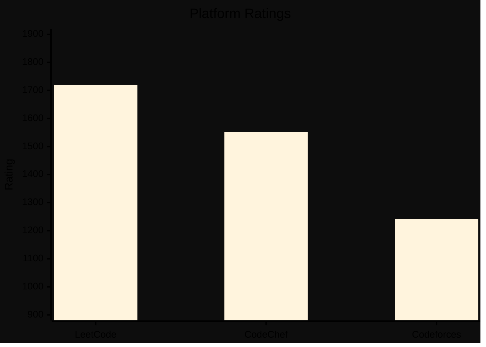
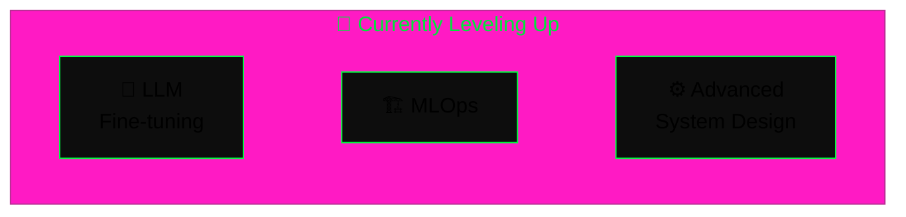

<!--
  GitHub Profile README — Prem P
  → Copy to: github.com/prem970/prem970/README.md

  Theme: terminal / hacker — green (#00FF41) on black
-->

<div align="center">

<br/>

```
╔══════════════════════════════════════════════════════════╗
║  prem@kit-cbe:~$ ./boot.sh                                ║
╠══════════════════════════════════════════════════════════╣
║  > whoami                                                 ║
║    Prem P — AI/ML Engineer · Full-Stack Dev · CP grinder  ║
║                                                            ║
║  > cat mission.txt                                        ║
║    Turn messy data into production-ready AI automation    ║
║                                                            ║
║  > status --check                                         ║
║    OPEN: internships & collaborations                     ║
╚══════════════════════════════════════════════════════════╝
```


<a href="https://www.linkedin.com/in/prem-p-8b709a32a/"></a>
<a href="mailto:premp.aiml2024@kitcbe.ac.in"></a>
<a href="https://github.com/prem970"></a>

<br/>


</div>

---

## ⚡ Identity Core

<table>
<tr>
<td width="52%" valign="top">

**`prem.agent.yaml`**

```yaml
agent:
  id: prem-p
  location: Coimbatore, Tamil Nadu 🇮🇳
  education: B.E. CSE (AI & ML) @ KIT-CBE · 2024–2028

mission: |
  Turn messy data & documents into production-ready
  AI-powered automation and full-stack systems.

runtime:
  core:   [Python, React, Node.js, Flutter]
  brain:  [LLMs, RAG, LangChain, YOLOv8, OpenCV]
  engine: [DSA · LeetCode · CodeChef · Codeforces]

modes:
  build:    backends · pipelines · agentic workflows
  compete:  algorithms · contests · optimization
  explore:  LLM fine-tuning · MLOps · system design

status: OPEN — internships & collaborations welcome
```

</td>
<td width="48%" align="center" valign="middle">

```
╔══════════════════════════════════════╗
║   PREM-OS  ·  agent runtime v2.026   ║
╠══════════════════════════════════════╣
║  ▰▰▰▰▰▰▰▰▰▰▰▰▱▱▱▱  initializing…     ║
║  ✓ ingest layer       ONLINE         ║
║  ✓ reasoning layer    ONLINE         ║
║  ✓ action layer       ONLINE         ║
║  ✓ DSA engine         WARM           ║
╠══════════════════════════════════════╣
║  > await collaboration_request()     ║
╚══════════════════════════════════════╝
```

<br/>


<br/>

</td>
</tr>
</table>

<div align="center">


</div>

---

## 📊 GitHub Dashboard

<div align="center">


<br/><br/>


<br/><br/>


<br/><br/>


<br/><br/>

**🏆 Hall of Fame**

<br/>


<br/>
<br/>


</div>

---

## 🛠️ Tech Arsenal

<div align="center">

**Languages & Frontend**

<br/>


<br/><br/>

**Backend · Cloud · AI · Tools**

<br/>


<br/>
<br/>


</div>
<br/>
<details>
<summary><b>📦 Full stack breakdown</b></summary>
<br/>

| Layer | Tools |
|:------|:------|
| **Languages** | Python · C · C++ · Java · JavaScript · HTML · CSS · SQL |
| **Frontend** | React · Flutter |
| **Backend** | Node.js · Express |
| **Cloud** | AWS |
| **AI / ML** | RAG · LLMs · LangChain · OpenCV · YOLOv8 · ResNet50 |
| **Automation** | N8N |
| **Data** | PostgreSQL · MongoDB |
| **DevOps** | Git · GitHub |

</details>

---

## 💼 Experience

<details open>
<summary><b>🏢 ULTRATEND — Gen AI Intern · Apr 2026 – Present · Remote, India</b></summary>
<br/>

```
[+] built AI-powered email outreach automation pipeline (LLM-personalized)
[+] automated end-to-end lead engagement workflows
[+] deployed multi-step N8N flows: ingest -> enrich -> follow-up
[+] shipped autonomous cold-outreach system, full funnel coverage
```

<br/>


</details>

---

## 🚀 Featured Projects

<div align="center">

| | Project | Stack | Impact |
|:--:|:--------|:------|:-------|
| 🎯 | [**Smart Face Attendance System**](https://github.com/prem970/smart-face-attendance-system) | `Python` `OpenCV` `YOLOv8` `ResNet50` | Real-time face detection + embeddings, live tracking, automatic attendance marking |
| 📚 | [**E-Learning Platform**](https://github.com/prem970/Odoo/tree/main) | `React` `Node.js` `Express` `PostgreSQL` | Relational course/user schemas, cloud-hosted DB, automated N8N email notifications |
| 🌾 | [**Precision Farming Assistant**](https://github.com/prem970/Agro) | `React` `N8N` `MongoDB` `Flutter` | RAG-powered chatbot for crop, soil & irrigation advice from PDFs and databases |

</div>

---

## 🏁 Competitive Programming

<div align="center">



</div>

<table align="center">
<tr>
<td align="center" width="33%">

### LeetCode
**1720** rating

`█████████░` 90%

**550+** solved · Top **31.86%**

Best rank **#6,934**

<br/>

[](https://leetcode.com/__Prem__P__)

</td>
<td align="center" width="33%">

### CodeChef
**1552** rating · ⭐⭐

`████████░░` 82%

**650+** problems

Global **#42,147** · Best **#1,083**

<br/>

[](https://www.codechef.com/users/kit28aiml048)

</td>
<td align="center" width="33%">

### Codeforces
**1241** rating

`███████░░░` 65%

**25** problems

Best **#3,238**

<br/>

[](https://codeforces.com/profile/kit28.24bam048)

</td>
</tr>
</table>

---

## 🎓 Education

| Level | Institution | Period | Score |
|:------|:------------|:-------|:------|
| **B.E. CSE — Artificial Intelligence & Machine Learning** | KIT – Kalaignarkarunanidhi Institute of Technology, Coimbatore | 2024 – 2028 | 8.2 / 10.0 CGPA |

**Coursework:** DBMS · Software Engineering with Agile Methodology · Machine Learning · Probability & Statistics

---

## 🔭 Lab — Currently Learning

<div align="center">



</div>

---

## 🎖️ Achievements & Certifications

<div align="center">

| 🏅 | Achievement | Details |
|:--:|:------------|:--------|
| 🥇 | **Hack Smart Hackathon — 1st Prize** | 36-hour hackathon · KIT-CBE |
| 🥇 | **Code Wars 2.0 — 1st Prize** | Park College of Engineering & Technology |
| 🥇 | **Code It — 1st Prize** | Sri RamaKrishna Institute of Technology |
| 🥇 | **Vibecode Arena — 1st Prize** | New Challenge Creator Category |
| 💻 | **LeetCode** | **1720** rating · **550+** solved · Top **31.86%** · Best **#6,934** · 3 Badges |
| ⚡ | **Codeforces** | **1241** rating · **25** problems · Best **#3,238** (Round 1075 Div. 2) |
| 🍴 | **CodeChef** | **1552** rating · ⭐⭐ · **650+** problems · Best **#1,083** (Starters 221 Div. 3) · Global **#42,147** |
| ☁️ | **AWS Certified Cloud Practitioner** | Amazon Web Services · 2025 |
| ☕ | **NPTEL — Programming in Java** | Silver + Elite · 2025 |
| 🐍 | **NPTEL — Problem Solving using C** | 2025 |
| 🔷 | **Deloitte Technology Job Simulation** | 2025 |
| 🤖 | **Google AI Professional Certificate** | 2026 |

</div>

---

<div align="center">

```
╔══════════════════════════════════════════════════╗
║  $ cat contact.txt                                ║
║  > LINKEDIN · GITHUB · EMAIL — open channel below ║
╚══════════════════════════════════════════════════╝
```

<br/>

<a href="https://www.linkedin.com/in/prem-p-8b709a32a/"></a>
<a href="https://github.com/prem970"></a>
<a href="mailto:premp.aiml2024@kitcbe.ac.in"></a>

<br/><br/>

```
> echo "The best time to plant a tree was 20 years ago. The second best time is now."
> exit 0
```

<br/>

</div>
